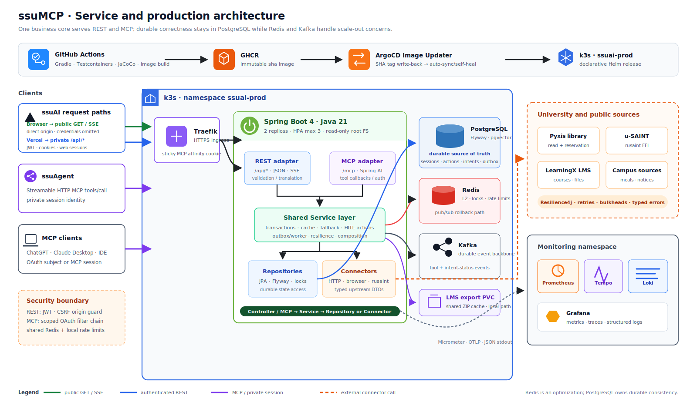

# ssuMCP

[](https://github.com/ghdtjdwn/ssuMCP/actions/workflows/ci.yml)
[](https://github.com/ghdtjdwn/ssuMCP/actions/workflows/security.yml)

**한국어** · [English](README.en.md)

숭실대학교의 공개·개인 데이터를 52개 MCP 도구와 REST API로 제공하는 Spring Boot 백엔드다.
학교 시스템 연동, 사용자별 인증 상태, 작업별 동의 계약, 장애 격리와 운영 관측을 한 서비스
경계 안에서 다룬다.

[웹 데모](https://ssuai.vercel.app) · [서버 상태](https://ssumcp.duckdns.org/actuator/health) ·
[플랫폼 사례 연구](https://seongju.vercel.app/projects/ssu-platform/) · [문서 지도](docs/README.md)

## 플랫폼에서 맡는 역할

| 서비스 | 책임 | 저장소 |
| --- | --- | --- |
| ssuAI | 사용자 화면, same-origin BFF, SSE 채팅 UX | [ghdtjdwn/ssuAI](https://github.com/ghdtjdwn/ssuAI) |
| ssuAgent | LangGraph 라우팅, 대화 상태, HITL 오케스트레이션 | [ghdtjdwn/ssuAgent](https://github.com/ghdtjdwn/ssuAgent) |
| **ssuMCP** | **캠퍼스 도메인 로직, MCP/REST 계약, 인증과 상태 변경** | 현재 저장소 |
| ssu-ai-service | 격리된 임베딩 요청 게이트웨이 | [ghdtjdwn/ssu-ai-service](https://github.com/ghdtjdwn/ssu-ai-service) |

`ssuMCP`는 원자적인 도메인 도구와 학교 시스템 연동을 소유한다. 자연어 의도 해석과 여러 도구의
조합은 `ssuAgent`, 화면과 브라우저 세션 경계는 `ssuAI`가 맡는다.

## 아키텍처



REST Controller와 MCP `@Tool` adapter는 같은 Service 계층을 호출한다. 외부 학교 시스템은
`*Connector` 인터페이스 뒤에 격리하고, mock 구현을 기본값으로 제공해 네트워크 없이도 빌드와 테스트가
가능하다. 상세 런타임·데이터·배포 경계는 [아키텍처 문서](docs/architecture.md)에 있다.

### 핵심 요청 흐름

```text
ssuAI REST/BFF 또는 MCP client
  → REST Controller / MCP Tool adapter
  → shared Service layer
  → PostgreSQL · Redis/Redisson · Kafka
  → u-SAINT · LMS · 도서관 · 학교 웹사이트 connector
```

- 공개 조회는 인증 없이 사용하고, 개인 조회는 OAuth subject 또는 소유권이 확인된 MCP 세션에만 연결한다.
- 좌석 예약·이석·반납과 LMS 내보내기는 `prepare_* → confirm_action`으로 분리해 사용자 승인 전에
  실행하지 않는다. `wait_for_library_seat`는 호출 자체가 자동 예약 동의이고, `cancel_library_wait`는
  명시적 대기 취소를 즉시 수행하는 예외다.
- 예약 intent는 PostgreSQL 행 잠금과 claim lease를 정합성 기준으로 삼고, 좌석별 Redisson lock은 중복
  upstream write를 줄이는 보조 계층으로 사용한다.
- 운영 상태 fan-out은 Kafka, 캐시·공유 rate limit·리더 선출은 Redis를 사용하며 장애 시 경로별로
  fail-open 또는 fail-closed 정책을 명시한다.

## 엔지니어링 근거

| 문제 | 구현과 검증 근거 |
| --- | --- |
| MCP 도구와 정적 server card의 계약 drift | [52-tool inventory/schema parity test](src/test/java/com/ssuai/domain/mcp/config/McpToolContractInventoryTests.java) · [live tool audit](docs/audits/2026-07-14-live-tool-hardening.md) |
| 사용자별 세션 혼선과 승인 없는 쓰기 | [authoritative session resolution](docs/adr/0098-authoritative-mcp-session-resolution.md) · [scoped confirm contract](docs/adr/0086-confirm-action-async-and-scoped-supersede.md) |
| 외부 API 지연·429·동시 예약 | [failure scenarios](docs/failure-scenarios.md) · [reservation concurrency integration test](src/test/java/com/ssuai/domain/library/reservation/intent/LibraryReservationIntentConcurrencyIT.java) |
| 검색 근거 추적과 임베딩 장애 | lexical + embedding RRF, source metadata, lexical fallback — [ADR 0020](docs/adr/0020-academic-policy-hybrid-rag.md) |
| 검증되지 않은 이미지의 자동 배포 | test/JaCoCo gate 뒤 multi-arch image publish — [CI workflow](.github/workflows/ci.yml) · [GitOps runbook](deploy/README.md) |
| 운영 장애의 재현과 예방 | [troubleshooting highlights](docs/troubleshooting-highlights.md) · [부하 실험](docs/performance/library-agent-load-test.md) |

주요 스택은 Java 21, Kotlin 2.4, Spring Boot 4.1, Spring AI, PostgreSQL, Redis/Redisson,
Kafka, Resilience4j, Testcontainers, Helm, ArgoCD, Prometheus, Tempo와 Loki다.

## 연결하기

원격 MCP를 지원하는 클라이언트에는 다음 endpoint를 등록한다.

```json
{
  "mcpServers": {
    "ssuMCP": {
      "url": "https://ssumcp.duckdns.org/mcp"
    }
  }
}
```

Claude Desktop, Cursor와 클라이언트별 인증 흐름은 [MCP 도구·인증 문서](docs/mcp-tools.md)에 정리했다.
Java 21 이상이 설치된 환경에서는 공개 런처로 self-host할 수 있다.

```bash
npx ssumcp
```

<details>
<summary>실제 MCP 클라이언트 연동 화면</summary>

개인 값과 활성 좌석 식별자는 공개용 이미지에서 비식별화했다. 화면은 한 번의 실제 연동 결과이며,
외부 학교 시스템의 모든 시점 가용성을 보장하지 않는다.

| 인증된 졸업요건 조회 | 승인 후 도서관 좌석 예약 |
| --- | --- |
|  |  |

| LMS 자료 내보내기 준비 | 단기 링크로 ZIP 다운로드 |
| --- | --- |
|  |  |

</details>

## 로컬 실행과 검증

기본 profile은 mock connector를 사용하므로 실제 학교 계정이나 외부 네트워크가 필요하지 않다.

```bash
git clone https://github.com/ghdtjdwn/ssuMCP.git
cd ssuMCP
./gradlew bootRun
```

검증 명령은 다음과 같다. Docker가 있으면 Testcontainers 기반 PostgreSQL·Redis 통합 테스트도 실행된다.
로컬에서 container test가 skip된 경우 통과로 간주하지 않으며, Docker가 있는 GitHub Actions가 권위
게이트다.

```bash
./gradlew test
./gradlew test jacocoTestReport jacocoTestCoverageVerification
./gradlew build
```

실제 connector와 운영 설정은 [`.env.example`](.env.example), [배포 runbook](deploy/README.md)을
참고한다. 실제 자격증명은 저장소에 커밋하지 않는다.

## 문서

- [문서 지도](docs/README.md)
- [MCP 도구와 인증 계약](docs/mcp-tools.md)
- [보안·세션·write consistency](docs/security-consistency.md)
- [ADR 목록](docs/adr/)
- [운영 장애 하이라이트](docs/troubleshooting-highlights.md)
- [면접 질문과 근거](docs/interview-qa.md)

## 범위와 제약

- 숭실대학교 공식 서비스가 아니며, 학교 웹페이지나 비공개 API 변경에 따라 connector가 일시적으로
  동작하지 않을 수 있다.
- 개인 도구는 유효한 학교 계정과 해당 provider 인증이 필요하다.
- 공개 데모와 Grafana는 포트폴리오 운영 환경이며 상용 SLA를 제공하지 않는다.

## 라이선스

[MIT](LICENSE)
